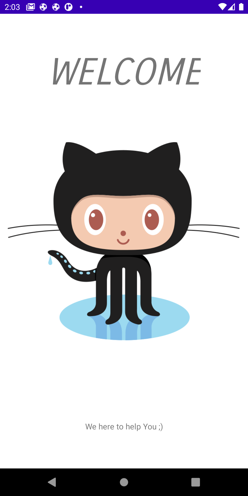
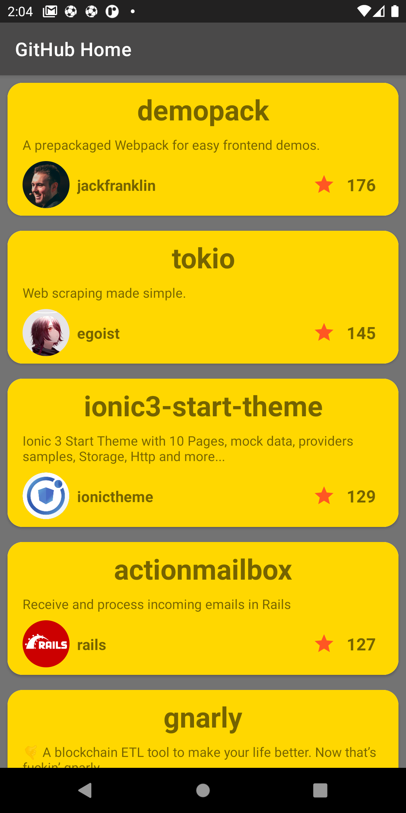

# Android-Projects
<h1> SELL3A App Video <h1>
<h2> Ecommerce App <h2>
https://www.linkedin.com/posts/taha-khalefah-46928115a_android-ios-mobile-activity-6817107777459101696--N-V

<h1> Super Wing <h1>

  
  
  
  
    
  
    
  
    
  
  
  
    
   
  
    

<h1> BestRepo </h1>
 
a small app that will list the most starred Github repos that were created in the last 30 days.

in this app, I am using Model View ViewModel (MVVM) + Facade +Singlton + Dependency Injection  Patterns

- Repository (Facade pattern) to collect the data from many sources

- singleton to make one object instance in memory when using it
  that help to improve the memory usage 
  
- MVVM the best design architecture I prefer it that help make my code readable and more organized and we can be testing it easy 

- Dependency Injection  Using Dagger-Hilt Make my code more readable and Reduced boilerplate code and we can testing the app easily 

Other Technology
----------------
  * Kotlin
  * Coroutine
  * Pagination
  * ViewBinding
  *  CardView
  * Material Design
  * Coil

  
  

  <h1> Pokemon </h1>
🗡️ Android Pokemon App using Dagger Hilt, RXjava,  Jetpack (Room, ViewModel, LiveData) based on MVVM architecture.
          
          
  Pokemon is a small demo application based on modern Android application tech-stacks and MVVM architecture.
  This project is for focusing especially on the new library Dagger-Hilt of implementing dependency injection.
  Also fetching data from the network and integrating persisted data in the database via repository pattern.
              
              
              
              
              
              
open api
------------
https://pokeapi.co/
