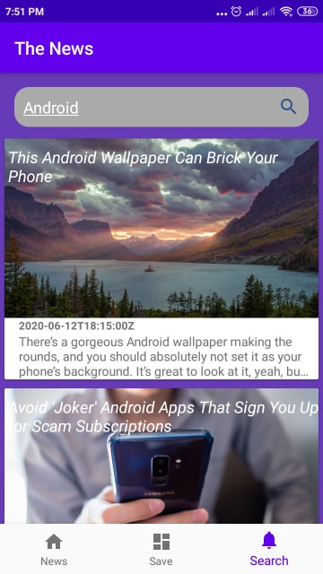

# Android-Projects
<h1> SELL3A App Video <h1>
<h2> Ecommerce App <h2>
https://www.linkedin.com/posts/taha-khalefah-46928115a_android-ios-mobile-activity-6817107777459101696--N-V

<h1> Super Wing <h1>

  
  
  
  
    
  
    
  
    
  
  
  
    
   
  
    

  
  <h1> Tripaway-App </h1>

Android Mobile Application that helps the user to record his planned trips with the start and end Geo-points, accompanied with the date and time of the trip and notes. The application should remind the user with his trips on the time specified by the user. In addition, the application should navigate the user to his destination. After that, the application should keep track with the upcoming and past trips.

Team
======
1- Heba Ali Ali           (Slider , Login , Design) 
2- Esraa Mohamed Goher    (Service&Alarm , Notification , Design) 
3- Yehia Mohamed Azab     (Map , Service , Design) 
4- Taha Khalefah Salama   (Room, MVVM ,Firebase , Design) 

Design Architecture
===================
Model View ViewModel
  
<h1> BestRepo </h1>
 
a small app that will list the most starred Github repos that were created in the last 30 days.

in this app, I am using Model View ViewModel (MVVM) + Facade +Singlton + Dependency Injection  Patterns

- Repository (Facade pattern) to collect the data from many sources

- singleton to make one object instance in memory when using it
  that help to improve the memory usage 
  
- MVVM the best design architecture I prefer it that help make my code readable and more organized and we can be testing it easy 

- Dependency Injection  Using Dagger-Hilt Make my code more readable and Reduced boilerplate code and we can testing the app easily 

Other Technology
----------------
  * Kotlin
  * Coroutine
  * Pagination
  * ViewBinding
  *  CardView
  * Material Design
  * Coil

  
  

  <h1> Pokemon </h1>
🗡️ Android Pokemon App using Dagger Hilt, RXjava,  Jetpack (Room, ViewModel, LiveData) based on MVVM architecture.
          
          
  Pokemon is a small demo application based on modern Android application tech-stacks and MVVM architecture.
  This project is for focusing especially on the new library Dagger-Hilt of implementing dependency injection.
  Also fetching data from the network and integrating persisted data in the database via repository pattern.
              
              
              
              
              
              
open api
------------
https://pokeapi.co/

  
<h1> The-News-App</h1>
show news and go to details
Using
-----
( Kotin _ MVVM  _ Repository _ Room _ Retrofit _ Glide _ WebView _ RecyclerView _ Navigation Component ) 
 
 
The main goal of the program is to learn
---------------------------------------
10-Pagenation
 
https://medium.com/@harunwangereka/android-paging-library-with-kotlin-coroutines-b96602e3fae3
https://medium.com/@lukasz.marczak314/learning-paging-by-example-star-wars-195b6b3a466d
https://proandroiddev.com/playing-with-4f21bc67a7f9
https://developer.android.com/topic/libraries/architecture/paging
 
11-Coroutines 
 
https://codelabs.developers.google.com/codelabs/kotlin-coroutines/#0
https://kotlinlang.org/docs/reference/coroutines-overview.html
https://kotlin.github.io/kotlinx.coroutines/kotlinx-coroutines-core/kotlinx.coroutines/-dispatchers/index.html
https://medium.com/androiddevelopers/coroutines-first-things-first-e6187bf3bb21
 
  

